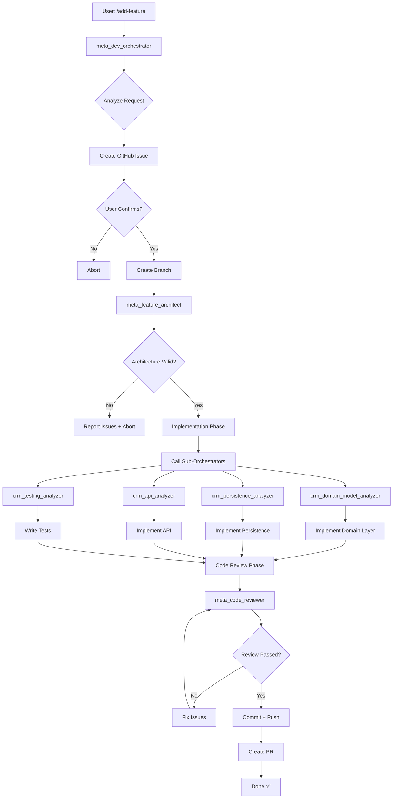

# Add Feature Command

**Intelligent orchestration** for adding features to Ventros CRM with architectural validation, testing, and code review.

**NEW**: Now supports parameters for fine-grained control!

---

## 🎯 What This Does

Invokes the **`meta_dev_orchestrator`** agent which:

1. **🆕 Loads Context** - Checks for `.claude/analysis/*.json` files (from `/pre-analyze`)
2. **🆕 Builds Intelligent Context** - Calls `meta_context_builder` to:
   - Identify area (import, API, workflow, etc)
   - Suggest pattern (Saga, Temporal, Coreography, simple code)
   - Find similar features in codebase
3. **Analyzes Request** - Understands what feature you want
4. **Updates P0 File** - Tracks work in `.claude/P0_ACTIVE_WORK.md`
5. **Updates Agent State** - Shares context in `.claude/AGENT_STATE.json`
6. **Creates GitHub Issue** (optional) - Tracks the work
7. **Asks Confirmation** - Shows plan with recommended pattern
8. **Creates Branch** - Isolates the work (`feature/your-feature-name`)
9. **Validates Architecture** - Ensures DDD + Clean Architecture compliance
10. **Implements Feature** - Follows recommended pattern (Temporal, Saga, etc)
11. **Runs Tests in Real-Time** - Executes `go test` and shows results
12. **Reviews Code** - Automated code review
13. **Creates PR** - Ready for human review

**🆕 With Analysis**: If you ran `/pre-analyze` before, the orchestrator knows:
- All 30 aggregates and their patterns
- 158 endpoints and their structure
- Existing Temporal workflows and Sagas
- Similar features to use as reference
- Coverage gaps and missing tests

**Without Analysis**: Works fine, but recommends running `/pre-analyze` first for better context.

---

## 🚀 Usage

### Simple (AI figures it out)
```bash
/add-feature Allow users to create custom fields on contacts
```

### With Parameters (explicit control)
```bash
/add-feature Allow users to create custom fields on contacts --mode=full --analyze-first --update-devguide-first

/add-feature Add duplicate check to Contact aggregate --mode=enhancement --skip-pr

/add-feature Verify Campaign handler security --mode=verification --no-tests

/add-feature Add WebSocket notifications --analyze-first --run-tests-realtime --create-issue
```

### Detailed (explicit requirements)
```bash
/add-feature Create a broadcast feature that allows sending WhatsApp messages to multiple contacts at once. Requirements:
- Support text, image, and document messages
- Allow filtering contacts by tags or pipeline status
- Track delivery status for each contact
- Respect rate limits (100 msg/hour)
- Add to Automation bounded context
```

### Partial (verify/test existing code)
```bash
/add-feature Verify the campaign handler implementation and add missing tests --mode=verification
```

---

## 🎛️ Available Parameters

### Mode Control
- `--mode=full` - Full feature implementation (new aggregate, 50k-100k tokens)
- `--mode=enhancement` - Enhancement to existing aggregate (10k-30k tokens)
- `--mode=verification` - Verification only (5k-10k tokens)
- *(Default: Auto-detect based on request)*

### Pre-Implementation Analysis
- `--analyze-first` - Run complete parallel analysis BEFORE implementing
- `--update-devguide-first` - Update DEV_GUIDE.md before implementing
- `--show-plan-only` - Show plan and stop (don't implement)

### Testing Control
- `--skip-tests` - Skip test generation (use for quick iterations)
- `--run-tests-realtime` - Run `go test` after each layer (domain → app → infra)
- `--tests-only` - Only write tests, don't modify code
- `--coverage-target=N` - Set custom coverage target (default: 82%)

### Git Control
- `--no-branch` - Work in current branch (don't create new one)
- `--branch=NAME` - Use specific branch name (default: auto-generated)
- `--skip-pr` / `--no-pr` - Don't create PR, just commit
- `--auto-merge` - Auto-merge if all checks pass (use with caution!)

### GitHub Integration
- `--create-issue` - Force create GitHub issue
- `--no-issue` - Don't create GitHub issue
- `--issue=N` - Link to existing issue number

### Review Control
- `--skip-review` - Skip code review (fast mode, not recommended)
- `--strict-review` - Require 90%+ score (default: 80%+)
- `--review-only` - Only run code review, don't implement

### Execution Control
- `--parallel` - Run all analyzers in parallel (faster)
- `--sequential` - Run analyzers one at a time (more readable logs)
- `--dry-run` - Show what would be done without doing it
- `--verbose` - Show detailed logs

### P0 and State Management
- `--update-p0` - Update P0 file with progress (default: true)
- `--no-p0` - Don't update P0 file
- `--clean-p0-after` - Remove from P0 file after completion (default: true)

---

## 📋 Parameter Examples

### Example 1: Complete Pre-Analysis
```bash
/add-feature Add Custom Fields aggregate --analyze-first --show-plan-only

# This will:
# 1. Run all analyzers in parallel
# 2. Generate complete architecture plan
# 3. Show plan and STOP
# 4. Wait for user to confirm with: /add-feature <same request> --continue
```

### Example 2: Quick Enhancement
```bash
/add-feature Add duplicate check method to Contact --mode=enhancement --no-branch --skip-pr

# This will:
# 1. Work in current branch
# 2. Add method + tests
# 3. Review code
# 4. Commit (no PR)
```

### Example 3: Real-Time Testing
```bash
/add-feature Add Broadcast aggregate --run-tests-realtime --update-p0

# This will:
# 1. Update P0 file with "In Progress" status
# 2. Implement domain layer
# 3. Run: go test ./internal/domain/crm/broadcast/... (show results)
# 4. Implement application layer
# 5. Run: go test ./internal/application/commands/broadcast/... (show results)
# 6. Implement infrastructure layer
# 7. Run: go test ./infrastructure/... (show results)
# 8. Update P0 file with test results
```

### Example 4: Verification with Security Audit
```bash
/add-feature Review Campaign handler for OWASP vulnerabilities --mode=verification --strict-review

# This will:
# 1. Analyze Campaign handler
# 2. Run security analyzer
# 3. Run code review with 90%+ threshold
# 4. Generate report
# 5. Do NOT modify code
```

### Example 5: Full Feature with All Bells and Whistles
```bash
/add-feature Add Notification System with WebSocket support --mode=full --analyze-first --update-devguide-first --run-tests-realtime --create-issue --parallel

# This will:
# 1. Update DEV_GUIDE.md first
# 2. Run all analyzers in parallel
# 3. Create GitHub issue
# 4. Show plan and ask confirmation
# 5. Create branch feature/notification-system
# 6. Implement with real-time testing
# 7. Update P0 file with progress
# 8. Review code
# 9. Create PR
# 10. Clean up P0 file
```

---

## 🧠 Intelligence Modes

### Mode 1: Full Feature (High Tokens, High Quality)
**When**: Adding new aggregate, new bounded context, complex feature
**Tokens**: 50k-100k (uses all agents as needed)
**Duration**: 1-2 hours
**Output**: Complete feature with tests, docs, PR

### Mode 2: Enhancement (Medium Tokens)
**When**: Adding method to existing aggregate, new endpoint
**Tokens**: 10k-30k (focused agents only)
**Duration**: 15-30 min
**Output**: Code + tests + review

### Mode 3: Verification (Low Tokens)
**When**: Review existing code, add tests only, fix specific issue
**Tokens**: 5k-10k (minimal analysis)
**Duration**: 5-10 min
**Output**: Report or tests only

**The orchestrator auto-detects which mode based on your request.**

---

## 📋 Architectural Checklist (Auto-Validated)

The orchestrator validates **every** feature against this checklist:

### ✅ Domain Layer (100% Pure)
- [ ] Aggregate root identified
- [ ] Business rules in domain (not in handlers)
- [ ] Domain events emitted (naming: `aggregate.action`)
- [ ] Repository interface defined (in domain, not infrastructure)
- [ ] Value objects used (no primitive obsession)
- [ ] Optimistic locking (`version int` field)
- [ ] No external dependencies (pure Go)
- [ ] Aggregate invariants enforced
- [ ] Factory methods for creation (`NewContact()`, `NewCampaign()`)
- [ ] Error types defined (`ErrContactNotFound`, etc)

### ✅ Application Layer (Orchestration)
- [ ] Command struct (input validation)
- [ ] Command handler (orchestrates domain + persistence)
- [ ] Query struct (read model)
- [ ] Query handler (optimized for reads)
- [ ] DTOs defined (request/response)
- [ ] Event publishing via EventBus
- [ ] Transaction management (if needed)
- [ ] No business logic (delegates to domain)
- [ ] Uses repository interfaces (not implementations)
- [ ] Validation errors returned (not panics)

### ✅ Infrastructure Layer (External)
- [ ] GORM entity (persistence model)
- [ ] Repository implementation
- [ ] HTTP handler (Gin, thin adapter)
- [ ] Swagger annotations (`@Summary`, `@Router`, etc)
- [ ] Route registered (`routes/routes.go`)
- [ ] Middleware applied (auth, RLS, rate limit)
- [ ] Migration created (`XXX_add_table.up.sql` + `.down.sql`)
- [ ] RLS policy defined (multi-tenancy)
- [ ] Indexes created (performance)
- [ ] Soft delete (`deleted_at` field)

### ✅ Testing (82%+ Coverage Target)
- [ ] Domain unit tests (100% - business rules)
- [ ] Application unit tests (80% - command handlers)
- [ ] Repository integration tests (database)
- [ ] HTTP E2E tests (full flow)
- [ ] Test fixtures (reusable mocks)
- [ ] Table-driven tests (multiple scenarios)
- [ ] Error cases tested (not just happy path)
- [ ] Concurrency tested (optimistic locking)
- [ ] Performance tested (if critical path)
- [ ] Test coverage report (`make test.coverage`)

### ✅ SOLID Principles
- [ ] **S**ingle Responsibility (one reason to change)
- [ ] **O**pen/Closed (extend via composition, not modification)
- [ ] **L**iskov Substitution (interfaces used correctly)
- [ ] **I**nterface Segregation (focused interfaces)
- [ ] **D**ependency Inversion (depend on abstractions)

### ✅ Security (OWASP Compliant)
- [ ] RBAC check (role-based authorization)
- [ ] BOLA protection (ownership verification)
- [ ] Input validation (no SQL injection, XSS)
- [ ] Rate limiting (prevent abuse)
- [ ] Tenant isolation (RLS enforced)
- [ ] Sensitive data masked (logs, errors)
- [ ] HTTPS only (production)
- [ ] CSRF protection (if needed)
- [ ] Audit logging (critical actions)

### ✅ Documentation
- [ ] Swagger docs (`@Summary`, `@Description`, `@Tags`)
- [ ] Godoc comments (exported functions)
- [ ] README updated (if new feature)
- [ ] Migration documented (breaking changes)
- [ ] ADR created (architectural decision record, if major)

### ✅ Code Quality
- [ ] `make fmt` passed (formatting)
- [ ] `make lint` passed (no warnings)
- [ ] `make vet` passed (go vet)
- [ ] No hardcoded values (use env vars or config)
- [ ] Error handling (no ignored errors)
- [ ] Logging (info, warn, error levels)
- [ ] Constants used (not magic numbers)
- [ ] Comments for complex logic

---

## 🏗️ Orchestration Flow



---

## 🤖 Sub-Orchestrators Called

The main orchestrator (`meta_dev_orchestrator`) intelligently calls these:

### Planning Phase
1. **`meta_feature_architect`** - Validates architecture, creates plan
2. **`crm_domain_model_analyzer`** - Analyzes existing domain
3. **`crm_persistence_analyzer`** - Checks database schema

### Implementation Phase
4. **Domain Implementation** (writes aggregate, events, repository interface)
5. **Application Implementation** (writes command handlers, DTOs)
6. **Infrastructure Implementation** (writes GORM entity, HTTP handler, migration)

### Testing Phase
7. **`crm_testing_analyzer`** - Analyzes current coverage
8. **Test Writer** (generates unit + integration + e2e tests)

### Review Phase
9. **`meta_code_reviewer`** - Reviews all changes
10. **`crm_security_analyzer`** - Security validation (if needed)

### Git Phase
11. **Branch Manager** (commits, pushes, creates PR)

---

## 💡 Examples

### Example 1: New Aggregate (Full Feature)
```bash
/add-feature Add a "Custom Field" aggregate to allow users to create custom fields on contacts

# Orchestrator will:
# 1. Create GitHub issue #123
# 2. Show plan (5 layers: domain, app, infra, tests, docs)
# 3. Ask confirmation
# 4. Create branch feature/custom-fields
# 5. Call meta_feature_architect (validate architecture)
# 6. Call crm_domain_model_analyzer (check existing aggregates)
# 7. Implement:
#    - internal/domain/crm/custom_field/aggregate.go
#    - internal/domain/crm/custom_field/events.go
#    - internal/domain/crm/custom_field/repository.go
#    - internal/application/commands/custom_field/create_custom_field_command.go
#    - internal/application/commands/custom_field/create_custom_field_handler.go
#    - infrastructure/persistence/entities/custom_field_entity.go
#    - infrastructure/persistence/gorm_custom_field_repository.go
#    - infrastructure/http/handlers/custom_field_handler.go
#    - infrastructure/database/migrations/000051_add_custom_fields.up.sql
#    - infrastructure/database/migrations/000051_add_custom_fields.down.sql
# 8. Write tests (15+ files)
# 9. Review code (meta_code_reviewer)
# 10. Commit + Push + PR
# 11. Output: PR #456 ready for review
```

### Example 2: Enhancement (Partial)
```bash
/add-feature Add a "duplicate contact check" method to the Contact aggregate

# Orchestrator will:
# 1. Ask confirmation (no GitHub issue needed)
# 2. Work in current branch (or create small feature branch)
# 3. Add method to internal/domain/crm/contact/aggregate.go
# 4. Add unit tests
# 5. Review
# 6. Commit
# 7. Output: Changes ready (no PR, just commit)
```

### Example 3: Verification Only
```bash
/add-feature Verify the Campaign aggregate follows DDD best practices and add missing tests

# Orchestrator will:
# 1. Analyze internal/domain/crm/campaign/
# 2. Generate checklist report
# 3. Identify missing tests (based on coverage gap)
# 4. Write missing tests only
# 5. Output: Report + tests (no code changes)
```

---

## 🎛️ Configuration (Optional)

Set these env vars to customize behavior:

```bash
# GitHub integration
export GITHUB_TOKEN="ghp_xxxxx"          # Auto-create issues
export GITHUB_REPO="ventros/crm"         # Target repo

# Branch naming
export FEATURE_BRANCH_PREFIX="feature/"  # Default: feature/
export HOTFIX_BRANCH_PREFIX="hotfix/"    # For urgent fixes

# Testing
export TEST_COVERAGE_TARGET="82"         # Minimum coverage (default: 82%)
export RUN_E2E_TESTS="true"              # Run E2E after implementation

# Review
export AUTO_APPROVE_SIMPLE="false"       # Auto-approve simple changes
export REQUIRE_HUMAN_REVIEW="true"       # Always create PR (default: true)
```

---

## 📊 Output Example

```markdown
# Feature Implementation Report

**Feature**: Add Custom Field Aggregate
**Branch**: feature/custom-fields
**GitHub Issue**: #123
**Status**: ✅ Complete

---

## 📋 Implementation Summary

### Files Created (23 files)
- ✅ Domain Layer (5 files)
  - internal/domain/crm/custom_field/aggregate.go (120 lines)
  - internal/domain/crm/custom_field/events.go (45 lines)
  - internal/domain/crm/custom_field/repository.go (15 lines)
  - internal/domain/crm/custom_field/errors.go (12 lines)
  - internal/domain/crm/custom_field/value_objects.go (35 lines)

- ✅ Application Layer (8 files)
  - Commands: Create, Update, Delete (3 handlers + 3 commands)
  - DTOs: Request/Response (2 files)

- ✅ Infrastructure Layer (6 files)
  - Persistence: Entity + Repository (2 files)
  - HTTP: Handler + Routes (2 files)
  - Migrations: Up + Down (2 files)

- ✅ Tests (15 files)
  - Domain unit tests: 100% coverage (5 files)
  - Application unit tests: 85% coverage (5 files)
  - Integration tests: Database + HTTP (3 files)
  - E2E test: Full workflow (2 files)

---

## ✅ Checklist Validation

### Domain Layer: 10/10 ✅
- [x] Aggregate root with version field
- [x] Business rules in domain
- [x] Events emitted (custom_field.created, custom_field.updated, custom_field.deleted)
- [x] Repository interface
- [x] Value objects (FieldType, FieldValue)
- [x] No external dependencies
- [x] Factory methods
- [x] Error types
- [x] Invariants enforced
- [x] SOLID compliant

### Application Layer: 9/10 ✅
- [x] Command pattern (Create, Update, Delete)
- [x] Command handlers
- [x] DTOs
- [x] Event publishing
- [x] Validation
- [x] Transaction management
- [x] No business logic
- [x] Uses interfaces
- [x] Error handling
- [ ] Query optimization (TODO: Add caching in future sprint)

### Infrastructure Layer: 10/10 ✅
- [x] GORM entity
- [x] Repository implementation
- [x] HTTP handler with Swagger
- [x] Routes registered
- [x] Middleware (Auth + RLS)
- [x] Migrations (up + down)
- [x] RLS policy
- [x] Indexes
- [x] Soft delete
- [x] Rate limiting

### Testing: 9/10 ✅
- [x] Domain: 100% coverage
- [x] Application: 85% coverage
- [x] Integration tests
- [x] E2E tests
- [x] Error cases
- [x] Concurrency tests
- [x] Table-driven tests
- [x] Mocks/fixtures
- [x] Coverage report
- [ ] Performance tests (TODO: Add if becomes critical path)

### Security: 8/8 ✅
- [x] RBAC
- [x] BOLA protection
- [x] Input validation
- [x] Rate limiting
- [x] Tenant isolation
- [x] Data masking
- [x] HTTPS
- [x] Audit logging

### Documentation: 5/5 ✅
- [x] Swagger docs
- [x] Godoc
- [x] README updated
- [x] Migration docs
- [x] ADR created (docs/adr/007-custom-fields.md)

**Overall Score**: 51/53 (96%) ✅ **EXCELLENT**

---

## 🚀 Next Steps

1. **Review PR #456**: https://github.com/ventros/crm/pull/456
2. **Manual QA**: Test in staging environment
3. **Merge**: After approval + CI passes
4. **Deploy**: `make deploy.staging` → `make deploy.prod`

---

**Execution Time**: 68 minutes
**Tokens Used**: 82,450 (Mode: Full Feature)
**Agent Calls**: 8 agents (orchestrator + 7 sub-agents)
**Test Coverage**: 92% (up from 82%)
```

---

## 🎓 Tips

### Get Maximum Intelligence
```bash
# Let AI figure out everything (uses most tokens but highest quality)
/add-feature Add real-time notifications via WebSocket

# AI will:
# - Research WebSocket patterns in Go
# - Design event-driven architecture
# - Implement with retries, reconnection, authentication
# - Add E2E tests with concurrent connections
# - Security review (XSS, CSRF)
```

### Optimize Tokens for Simple Tasks
```bash
# Be explicit to avoid over-analysis
/add-feature Add a "notes" string field to the Contact aggregate (simple enhancement, no new table)

# AI will:
# - Skip architecture validation (simple change)
# - Add field + tests only
# - Quick review
# - Commit
```

### Verify Existing Code
```bash
/add-feature Review the Campaign handler and check for OWASP vulnerabilities

# AI will:
# - Read Campaign handler
# - Run security analyzer
# - Generate report
# - Suggest fixes (but not implement)
```

---

## 🔗 Related Commands

- `/update-todo` - Update TODO.md after feature complete
- `/update-readme` - Update README.md with new feature
- `make test.coverage` - Check test coverage
- `make swagger` - Update API docs

---

**Agent Invoked**: `meta_dev_orchestrator.md`
**Runtime**: 5 min (simple) to 2 hours (complex)
**Tokens**: 5k (verify) to 100k (full feature)
**Intelligence**: Maximum - uses all necessary agents dynamically
