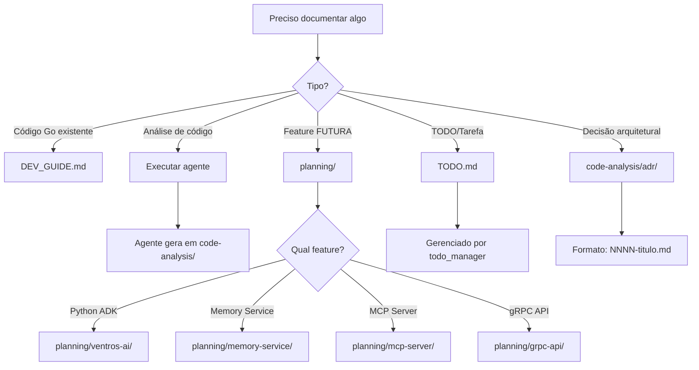

# 📋 REGRAS DE ORGANIZAÇÃO - VENTROS CRM

**Data**: 2025-10-15
**Versão**: 1.0
**Propósito**: Definir estrutura de pastas, regras de documentação e responsabilidades

---

## 🎯 PRINCÍPIOS FUNDAMENTAIS

1. **Source of Truth Único**: Cada tipo de informação tem UM lugar oficial
2. **Geração Automática**: Documentação gerada por agentes (code-analysis/)
3. **Mínimo na Raiz**: Apenas arquivos essenciais no diretório raiz
4. **Docs/ = Swagger Only**: docs/ contém APENAS código Swagger (Go)
5. **Planning/ = Futuro**: Documentação de features NÃO implementadas
6. **Code-Analysis/ = Outputs**: Outputs de agentes de análise

---

## 📁 ESTRUTURA DE PASTAS (REGRAS)

### 1. RAIZ (/) - APENAS ARQUIVOS ESSENCIAIS

**Permitidos** (7 arquivos markdown):

```
/
├── README.md                 # Visão geral do projeto (OBRIGATÓRIO)
├── CLAUDE.md                 # Instruções para Claude Code (OBRIGATÓRIO)
├── DEV_GUIDE.md             # Guia completo do desenvolvedor (OBRIGATÓRIO)
├── TODO.md                  # Roadmap master (gerenciado por todo_manager)
├── MAKEFILE.md              # Referência de comandos make
├── P0.md                    # Template de refatoração (referência)
└── ORGANIZATION_RULES.md    # Este arquivo (regras de organização)
```

**PROIBIDO na raiz**:
- ❌ Documentos de análise (vai para code-analysis/)
- ❌ Documentos de planejamento (vai para planning/)
- ❌ TODOs fragmentados (consolidar em TODO.md)
- ❌ Relatórios de análise (vai para code-analysis/)
- ❌ Documentação de features futuras (vai para planning/)
- ❌ Arquivos temporários (continue_task.md, etc)

---

### 2. docs/ - APENAS SWAGGER (Go Code)

**Permitidos**:
```
docs/
├── docs.go                   # Swagger main definitions (Go code)
├── swagger_definitions.go    # Swagger model definitions (Go code)
├── swagger_tags.go           # Swagger tag definitions (Go code)
├── swagger.json              # Gerado por swag init
└── swagger.yaml              # Gerado por swag init
```

**PROIBIDO em docs/**:
- ❌ Arquivos markdown (.md)
- ❌ Documentação de arquitetura
- ❌ Guias de desenvolvimento
- ❌ Qualquer coisa que não seja Swagger (Go code + generated JSON/YAML)

**Regeneração**:
```bash
make swagger  # Regenera swagger.json e swagger.yaml a partir de *.go
```

**Explicação**:
- `docs.go`: Package docs + general info
- `swagger_definitions.go`: Struct definitions para API models
- `swagger_tags.go`: Tag metadata para agrupar endpoints
- `swagger.json`, `swagger.yaml`: Gerados automaticamente por `swag init`

---

### 3. code-analysis/ - OUTPUTS DE AGENTES

**Estrutura**:
```
code-analysis/
├── README.md                      # Índice master (gerenciado por docs_index_manager)
│
├── architecture/                  # Análises arquiteturais
│   ├── baseline_analysis.md       # deterministic_analyzer (SEMPRE executar primeiro)
│   ├── AI_REPORT_COMPLETE.md      # Relatório arquitetural completo (futuro)
│   └── ARCHITECTURE_DECISIONS.md  # ADRs consolidados
│
├── domain/                        # Análises de domínio (DDD)
│   ├── domain_model_analysis.md   # domain_model_analyzer (30 aggregates)
│   ├── entity_relationships_analysis.md  # entity_relationships_analyzer
│   ├── value_objects_analysis.md  # value_objects_analyzer (50+ VOs)
│   ├── events_analysis.md         # events_analyzer (182 events)
│   ├── use_cases_analysis.md      # use_cases_analyzer (100+ use cases)
│   └── workflows_analysis.md      # workflows_analyzer (Temporal sagas)
│
├── infrastructure/                # Análises de infraestrutura
│   ├── persistence_analysis.md    # persistence_analyzer (repos, RLS)
│   ├── api_analysis.md            # api_analyzer (158 endpoints)
│   ├── integration_analysis.md    # integration_analyzer (12+ services)
│   └── resilience_analysis.md     # resilience_analyzer (retry patterns)
│
├── quality/                       # Análises de qualidade
│   ├── security_analysis.md       # security_analyzer (P0 vulnerabilities)
│   ├── testing_analysis.md        # testing_analyzer (coverage 82%+)
│   ├── code_style_analysis.md     # code_style_analyzer (Go idioms)
│   ├── solid_principles_analysis.md  # solid_principles_analyzer
│   └── documentation_analysis.md  # documentation_analyzer (godoc)
│
├── ai-ml/                         # Análises de AI/ML
│   └── ai_ml_analysis.md          # ai_ml_analyzer (memory service, agents)
│
├── comprehensive/                 # Relatórios consolidados
│   └── MASTER_ANALYSIS.md         # orchestrator (consolida todos)
│
├── adr/                          # Architecture Decision Records
│   ├── 0001-use-ddd.md
│   ├── 0002-use-cqrs.md
│   └── ...
│
└── archive/                      # Análises antigas (históricas)
    └── YYYY-MM-DD/               # Organizadas por data
        ├── root/                 # Arquivos movidos da raiz
        ├── docs/                 # Arquivos movidos de docs/
        └── todos/                # TODOs antigos consolidados
```

**REGRAS**:
1. ✅ **TODOS os arquivos são gerados por agentes** (não criar manualmente)
2. ✅ **Sempre executar deterministic_analyzer primeiro** (baseline)
3. ✅ **README.md atualizado por docs_index_manager** (automático)
4. ✅ **Archive com data YYYY-MM-DD** (nunca sobrescrever)
5. ❌ **NUNCA commitar análises obsoletas** (mover para archive/)

---

### 4. planning/ - FEATURES FUTURAS (NÃO IMPLEMENTADAS)

**Estrutura**:
```
planning/
├── README.md                      # Índice (gerenciado por docs_index_manager)
├── ARCHITECTURE_OVERVIEW.md       # Visão geral CORRETA da arquitetura
│
├── ventros-ai/                    # Python ADK (Sprints 19-30)
│   ├── ARCHITECTURE.md            # Arquitetura completa (9053 linhas)
│   ├── AGENT_CATALOG.md           # Catálogo de 20+ agentes (futuro)
│   └── DEPLOYMENT.md              # Deploy Docker + K8s (futuro)
│
├── memory-service/                # Memory Service (Sprints 5-11)
│   ├── ARCHITECTURE.md            # Arquitetura completa (5989 linhas)
│   ├── VECTOR_SEARCH.md           # pgvector implementation (futuro)
│   ├── HYBRID_SEARCH.md           # Vector + keyword + graph (futuro)
│   └── MEMORY_EXTRACTION.md       # LLM-based facts (futuro)
│
├── mcp-server/                    # MCP Server (Sprints 15-18)
│   ├── MCP_SERVER_COMPLETE.md     # Spec completa (1500 linhas)
│   ├── TOOLS_CATALOG.md           # 30 tools for Claude (futuro)
│   └── DEPLOYMENT.md              # Deploy guide (futuro)
│
└── grpc-api/                      # gRPC API (Sprints 12-14)
    ├── SPECIFICATION.md           # API spec completa (futuro)
    ├── go-to-python.proto         # Agent execution (futuro)
    ├── python-to-go.proto         # Memory access (futuro)
    └── EXAMPLES.md                # Exemplos de uso (futuro)
```

**REGRAS**:
1. ✅ **APENAS features NÃO implementadas** (Sprint 5+)
2. ✅ **Documentação de arquitetura detalhada**
3. ✅ **SEMPRE incluir sprint timeline** (quando será implementado)
4. ✅ **README.md com status de implementação** (0%, 20%, 100%)
5. ❌ **NUNCA documentar features JÁ implementadas** (usar DEV_GUIDE.md)

---

### 5. .claude/ - CONFIGURAÇÃO DE AGENTES

**Estrutura**:
```
.claude/
├── agents/                        # Definições de agentes (24 total)
│   ├── README.md                  # Catálogo completo (versão 4.0)
│   ├── orchestrator.md            # Meta-agent (coordena análise completa)
│   ├── todo_manager.md            # Gerencia TODO.md (sync com código)
│   ├── docs_index_manager.md      # Gerencia índices README.md
│   ├── docs_consolidator.md       # Consolida documentação
│   │
│   ├── domain_model_analyzer.md   # Análise de agregados (DDD)
│   ├── security_analyzer.md       # Análise de segurança (P0)
│   ├── testing_analyzer.md        # Análise de cobertura (82%+)
│   └── ... (18 mais)
│
└── commands/                      # Slash commands
    ├── update-todo.md             # /update-todo (chama todo_manager)
    ├── update-indexes.md          # /update-indexes (chama docs_index_manager)
    ├── full-analysis.md           # /full-analysis (chama orchestrator)
    ├── quick-audit.md             # /quick-audit (P0 security only)
    └── consolidate-docs.md        # /consolidate-docs (chama docs_consolidator)
```

**REGRAS**:
1. ✅ **24 agentes** (18 analysis + 4 meta + 2 management)
2. ✅ **README.md sempre atualizado** (versão, count, cross-refs)
3. ✅ **Cada agente tem**:
   - `name:` (slug único)
   - `description:` (propósito)
   - `tools:` (Read, Write, Grep, Glob, Bash)
   - `model:` (sonnet ou haiku)
   - Output path em code-analysis/
4. ✅ **Slash commands** referenciam agentes
5. ❌ **NUNCA duplicar agentes** (consolidar se houver overlap)

---

### 6. ai-guides/ - GUIAS PARA AI (Claude Code)

**Estrutura**:
```
ai-guides/
├── claude-code-guide.md           # Guia de uso do Claude Code
├── claude-guide.md                # Guia Claude (geral)
├── prompt-engineering-guide.md    # Prompt engineering best practices
└── notes/                         # Notas temporárias
    └── ai_report_raw.txt          # Raw notes (pode ser deletado)
```

**REGRAS**:
1. ✅ **Guias para melhorar interação com Claude**
2. ✅ **Best practices de prompting**
3. ❌ **NÃO documentar código aqui** (usar DEV_GUIDE.md)
4. ❌ **Evitar duplicação** (se já está em CLAUDE.md, não repetir)

---

### 7. /tmp/ - ARQUIVOS TEMPORÁRIOS (Agentes de IA)

**Propósito**: Armazenamento temporário para agentes durante execução

**Casos de Uso**:
```
/tmp/
├── agent_workspace/               # Workspace temporário de agentes
│   ├── task_12345/                # Contexto de task em andamento
│   │   ├── context.json           # Estado do agente
│   │   ├── intermediate.md        # Resultados intermediários
│   │   └── artifacts/             # Arquivos gerados
│   └── proposal_uuid.pdf          # PDFs temporários gerados
│
├── analysis_cache/                # Cache temporário de análises
│   └── codebase_snapshot.json     # Snapshot para reuso
│
└── downloads/                     # Downloads temporários
    └── imported_data.csv          # Dados importados
```

**REGRAS**:
1. ✅ **Agentes PODEM criar arquivos em /tmp/**
   - Contexto de task em andamento
   - Artifacts intermediários (PDFs, CSVs, JSONs)
   - Cache temporário para otimização

2. ✅ **Python ADK pode gerar arquivos temporários**:
   - Propostas comerciais (PDF)
   - Relatórios (Excel, CSV)
   - Imagens processadas (PNG, JPG)
   - Áudios transcritos (MP3 → texto)

3. ✅ **Go CRM move arquivos de /tmp/ para persistência**:
   ```go
   // Python ADK gera em /tmp/
   pdfPath := "/tmp/proposal_uuid.pdf"

   // Go CRM move para S3
   s3URL, err := s3Client.Upload(pdfPath, "proposals/uuid.pdf")
   // Deleta /tmp/proposal_uuid.pdf após upload
   os.Remove(pdfPath)
   ```

4. ❌ **NUNCA commitar /tmp/**:
   - Adicionar em `.gitignore`:
     ```
     /tmp/
     ```

5. ✅ **Cleanup automático**:
   - Go CRM limpa /tmp/ a cada 1 hora
   - Python ADK limpa ao finalizar task
   - Docker container restart limpa tudo

**Lifetime**:
- **Durante execução**: Arquivos existem em /tmp/
- **Após conclusão**: Go CRM move para S3 (se necessário)
- **Após 1 hora**: Cleanup automático deleta tudo

**Exemplo Completo**:
```go
// Passo 1: Go CRM chama Python ADK
resp := agentClient.ExecuteAgent(ctx, &pb.ExecuteAgentRequest{
    AgentType: "ProposalAgent",
    ContactID: contactID,
})

// Passo 2: Python ADK gera PDF em /tmp/
// (internamente no Python)
proposal_path = "/tmp/proposal_550e8400.pdf"
generate_pdf(proposal_path)  # Gera proposta

// Passo 3: Python retorna path para Go CRM
return AgentResponse{
    response: "Proposta criada!",
    attachments: ["/tmp/proposal_550e8400.pdf"],
}

// Passo 4: Go CRM faz upload para S3
s3URL, _ := s3Client.Upload("/tmp/proposal_550e8400.pdf", "proposals/550e8400.pdf")

// Passo 5: Go CRM deleta arquivo temporário
os.Remove("/tmp/proposal_550e8400.pdf")

// Passo 6: Go CRM persiste referência no banco
message.AddAttachment(s3URL)  // https://s3.../proposals/550e8400.pdf
messageRepo.Save(message)
```

---

## 🤖 AGENTES DISPONÍVEIS (24 TOTAL)

### Meta-Agents (4)

| Agente | Propósito | Trigger | Runtime |
|--------|-----------|---------|---------|
| `orchestrator` | Coordena análise completa (30 tabelas) | `/full-analysis` | 2h |
| `docs_consolidator` | Consolida fragmentos de documentação | `/consolidate-docs` | 15min |
| `adr_generator` | Gera Architecture Decision Records | Manual | 10min |
| `deterministic_analyzer` | Baseline metrics (SEMPRE executar primeiro) | Manual | 5min |

### Management Agents (2)

| Agente | Propósito | Trigger | Runtime |
|--------|-----------|---------|---------|
| `todo_manager` | Consolida TODO.md, sync com código | `/update-todo` | 15min |
| `docs_index_manager` | Atualiza todos README.md indexes | `/update-indexes` | 8min |

### Analysis Agents (18)

#### Domain Analysis (6 agents)

| Agente | Output | Cobertura |
|--------|--------|-----------|
| `domain_model_analyzer` | domain_model_analysis.md | 30 aggregates |
| `entity_relationships_analyzer` | entity_relationships_analysis.md | Aggregate relationships |
| `value_objects_analyzer` | value_objects_analysis.md | 50+ value objects |
| `events_analyzer` | events_analysis.md | 182 domain events |
| `use_cases_analyzer` | use_cases_analysis.md | 80+ commands, 20+ queries |
| `workflows_analyzer` | workflows_analysis.md | Temporal workflows, sagas |

#### Infrastructure Analysis (4 agents)

| Agente | Output | Cobertura |
|--------|--------|-----------|
| `persistence_analyzer` | persistence_analysis.md | Repositories, RLS policies |
| `api_analyzer` | api_analysis.md | 158 REST endpoints |
| `integration_analyzer` | integration_analysis.md | 12+ external services |
| `resilience_analyzer` | resilience_analysis.md | Retry patterns, circuit breakers |

#### Quality Analysis (7 agents)

| Agente | Output | Cobertura |
|--------|--------|-----------|
| `security_analyzer` | security_analysis.md | P0 vulnerabilities, OWASP |
| `testing_analyzer` | testing_analysis.md | Coverage 82%+, test pyramid |
| `code_style_analyzer` | code_style_analysis.md | Go idioms, formatting |
| `solid_principles_analyzer` | solid_principles_analysis.md | SOLID violations |
| `documentation_analyzer` | documentation_analysis.md | godoc coverage |
| `data_quality_analyzer` | (embedded in others) | Data validation |
| `workflows_analyzer` | workflows_analysis.md | Workflow patterns |

#### AI/ML Analysis (1 agent)

| Agente | Output | Cobertura |
|--------|--------|-----------|
| `ai_ml_analyzer` | ai_ml_analysis.md | Memory service, agents, embeddings |

**Total Coverage**: 100% (todos os 30 aspectos do AI_REPORT antigo)

---

## 🔄 WORKFLOW DE DOCUMENTAÇÃO

### Quando Criar Novo Arquivo



### Quando Atualizar Documentação

**Automático** (via agentes):
- ✅ TODO.md → todo_manager (semanal ou pós-feature)
- ✅ code-analysis/README.md → docs_index_manager (pós-análise)
- ✅ planning/README.md → docs_index_manager (pós-consolidação)
- ✅ code-analysis/**/*.md → agentes específicos (conforme necessário)

**Manual** (dev humano):
- ⚠️ DEV_GUIDE.md → ao adicionar nova feature IMPLEMENTADA
- ⚠️ CLAUDE.md → ao mudar stack ou comandos críticos
- ⚠️ README.md → ao mudar setup inicial
- ⚠️ planning/**/*.md → ao planejar nova feature

---

## 📊 TABELA DE DECISÃO: ONDE CRIAR ARQUIVO

| Cenário | Local | Responsável | Exemplo |
|---------|-------|-------------|---------|
| Documentar código Go EXISTENTE | DEV_GUIDE.md | Dev/Claude | "Como funciona Outbox Pattern" |
| Documentar feature FUTURA | planning/ | Dev/Claude | "Arquitetura Python ADK" |
| Análise de segurança | code-analysis/quality/ | security_analyzer | security_analysis.md |
| Análise de testes | code-analysis/quality/ | testing_analyzer | testing_analysis.md |
| Análise de domínio | code-analysis/domain/ | domain_model_analyzer | domain_model_analysis.md |
| Nova tarefa/bug | TODO.md | todo_manager | "P0-6: Fix SQL injection" |
| Decisão arquitetural | code-analysis/adr/ | adr_generator | 0003-use-grpc.md |
| Comando make | MAKEFILE.md | Dev | "make test-e2e" |
| Instrução Claude | CLAUDE.md | Dev | "NEVER use AutoMigrate in prod" |
| README índice | */README.md | docs_index_manager | Auto-gerado |
| Relatório consolidado | code-analysis/comprehensive/ | orchestrator | MASTER_ANALYSIS.md |
| Arquivo temporário | /tmp/ ou deletar | Dev | continue_task.md (NÃO COMMITAR) |

---

## ⚠️ ANTI-PATTERNS (O QUE NÃO FAZER)

### ❌ Duplicação de Informação

**ERRADO**:
```
/README.md                    # "Como fazer setup"
/DEV_GUIDE.md                 # "Como fazer setup" (duplicado)
/docs/SETUP.md                # "Como fazer setup" (triplicado)
```

**CORRETO**:
```
/README.md                    # Setup rápido (5 min read)
/DEV_GUIDE.md                 # Referência completa (aponta para README na seção setup)
```

---

### ❌ Documentação em Múltiplos Locais

**ERRADO**:
```
/TODO.md                      # Roadmap parcial
/TODO_PYTHON.md               # Roadmap Python
/todo_go_pure.md              # Roadmap consolidação
```

**CORRETO**:
```
/TODO.md                      # Roadmap ÚNICO (consolidado por todo_manager)
```

---

### ❌ Análises Manuais em code-analysis/

**ERRADO**:
```
code-analysis/quality/my_manual_security_audit.md  # Criado manualmente
```

**CORRETO**:
```
# Executar agente ao invés de criar manualmente
/full-analysis  # Gera via security_analyzer
```

---

### ❌ Features Implementadas em planning/

**ERRADO**:
```
planning/outbox-pattern/ARCHITECTURE.md  # Outbox JÁ está implementado!
```

**CORRETO**:
```
DEV_GUIDE.md  # Seção: "Event Publishing via Outbox Pattern"
```

---

### ❌ Markdown em docs/

**ERRADO**:
```
docs/API_DOCUMENTATION.md  # Documentação de API
```

**CORRETO**:
```
docs/swagger.json  # Swagger spec (código gerado)
# OU
DEV_GUIDE.md seção "API Endpoints"
```

---

## 🎯 CHECKLIST ANTES DE COMMITAR

Antes de commitar novo arquivo markdown:

- [ ] Arquivo está na pasta correta? (raiz / planning / code-analysis / ai-guides)
- [ ] Não duplica informação existente?
- [ ] Se é análise, foi gerado por agente? (não manual)
- [ ] Se é planning, feature NÃO está implementada?
- [ ] Se está na raiz, é um dos 7 permitidos?
- [ ] README.md atualizado? (via docs_index_manager)
- [ ] TODO.md atualizado se necessário? (via todo_manager)
- [ ] docs/ contém APENAS Swagger? (sem .md)

---

## 📅 MANUTENÇÃO PERIÓDICA

### Semanal

```bash
# 1. Atualizar TODO.md
/update-todo

# 2. Atualizar índices
/update-indexes

# 3. Arquivar análises antigas (se houver)
mkdir -p code-analysis/archive/$(date +%Y-%m-%d)
# Mover análises > 30 dias
```

### Mensal

```bash
# 1. Análise completa
/full-analysis

# 2. Revisar DEV_GUIDE.md
# - Adicionar features implementadas no último mês
# - Remover referências obsoletas

# 3. Revisar planning/
# - Mover features implementadas para DEV_GUIDE.md
# - Atualizar % de progresso

# 4. Limpar raiz
# - Verificar se apenas 7 arquivos .md
# - Mover extras para archive/
```

---

## 🔗 CROSS-REFERENCES (Como Ligar Docs)

### From DEV_GUIDE.md → planning/

```markdown
## Memory Service (Future Feature)

**Status**: 🔴 Planned (Sprint 5-11)

Para arquitetura completa, veja: [planning/memory-service/ARCHITECTURE.md](planning/memory-service/ARCHITECTURE.md)
```

### From planning/ → code-analysis/

```markdown
## Implementation Status

**Current Coverage**: 20% (see analysis)

- ✅ pgvector extension installed
- ⏳ Vector search (see: [code-analysis/ai-ml/ai_ml_analysis.md](../code-analysis/ai-ml/ai_ml_analysis.md))
- ❌ Hybrid search (not started)
```

### From TODO.md → code-analysis/

```markdown
## Sprint 1-2: Security Fixes (P0)

### P0-1: Dev Mode Bypass ✅ COMPLETE
**Evidence**: [code-analysis/quality/security_analysis.md:L45](code-analysis/quality/security_analysis.md#L45)
```

---

## 🚀 EXEMPLO COMPLETO: Adicionar Nova Feature

### Cenário: Implementar Campaign Analytics Dashboard

**Passo 1: Planejar** (antes de código)
```bash
# Criar docs em planning/
touch planning/campaign-analytics/ARCHITECTURE.md
touch planning/campaign-analytics/UI_MOCKUPS.md
touch planning/campaign-analytics/METRICS.md

# Adicionar ao TODO.md
/update-todo
# Manualmente adicionar: "Sprint 35: Campaign Analytics (3 semanas)"
```

**Passo 2: Implementar** (durante dev)
```go
// Código Go em internal/domain/automation/campaign_analytics/
// Testes em internal/domain/automation/campaign_analytics/campaign_analytics_test.go
```

**Passo 3: Analisar** (pós-implementação)
```bash
# Executar análise completa
/full-analysis
# Gera: code-analysis/domain/domain_model_analysis.md (atualizado)

# Atualizar TODO
/update-todo
# Marca "Sprint 35" como COMPLETE
```

**Passo 4: Documentar** (para outros devs)
```markdown
# Adicionar em DEV_GUIDE.md seção "Campaign Analytics"

## Campaign Analytics Dashboard

**Status**: ✅ Implemented (Sprint 35)

[... explicação de como usar ...]

**Architecture**: See archived planning docs in [code-analysis/archive/2025-10-15/planning/campaign-analytics/](code-analysis/archive/2025-10-15/planning/campaign-analytics/)
```

**Passo 5: Arquivar** (manter histórico)
```bash
# Mover planning/ docs para archive (já implementado)
mkdir -p code-analysis/archive/2025-10-15/planning/campaign-analytics
mv planning/campaign-analytics/* code-analysis/archive/2025-10-15/planning/campaign-analytics/
rmdir planning/campaign-analytics
```

---

## ✅ SUCESSO METRICS

Organização está correta se:

1. ✅ Raiz tem <= 7 arquivos .md
2. ✅ docs/ tem APENAS 3 arquivos (docs.go, swagger.json, swagger.yaml)
3. ✅ planning/ tem APENAS features NÃO implementadas
4. ✅ code-analysis/ tem APENAS outputs de agentes
5. ✅ TODO.md é fonte única de verdade (sem TODOs fragmentados)
6. ✅ Todos README.md estão atualizados (via docs_index_manager)
7. ✅ Zero duplicação de informação
8. ✅ Zero arquivos temporários commitados (continue_task.md, etc)
9. ✅ Zero análises manuais em code-analysis/ (apenas geradas por agentes)
10. ✅ Zero markdown em docs/

---

**Versão**: 1.0
**Última Atualização**: 2025-10-15
**Responsável**: Claude Code (documentação consolidada)
**Próxima Revisão**: Mensal (15 de cada mês)
